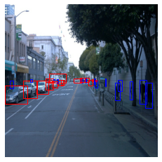

# WriteUp Object -- Detection in an Urban Environment

## Project overview

In the project we managed to use many skills/Python API functions studied from the previous lessons. The aim of this project is to detect traffic relevant objects in an urban environment by using [Waymo Open dataset](https://waymo.com/open/). The data can be downloaded directly from the website as tar files or from the [Google Cloud Bucket](https://console.cloud.google.com/storage/browser/waymo_open_dataset_v_1_2_0_individual_files/) as individual tf records. 

## Set up

The project is finished in the online-workspace, where the data has already been downloaded and organized. At the very beginning, each data anlyst has to explore the dataset carefully. This is the most important part of evert machine learning project. Hence, the first task is to add the code in the `Exploratory Data Analysis` jupyter notebook and run them with our dataset. Thus, we are able to explore the dataset used for training, validation (to see if the split is reasonable, naja, the split in the current project seems to be not necessary). After that we have to modify the config files to specify the parameters for the trainning. The most imporant things are 1. the batch size. 2 step size. I noticed that some template files from workspace is not the same as those from gitlab [this repository](https://github.com/udacity/nd013-c1-vision-starter). There are two at least two critical differences. (a). the step size in the repo of github, is 10 times as those in the workspace. (b) the `Explore Augmentations` jupyter notebook in workspace is not accessible, but the one from github is correct. 

## Data Set

In the `Exploratory Data Analysis` jupyter notebook I performed some statistical analysis for the dataset. In the images the traffic relevant objects (mainly vehicles, pedestrians and cyclists) are marked by rectangular bounding boxes. As we have seen in the following, the images are taken from different places, time of a day as well as diverse weather conditions. The most striking ones are the third and the ten-th image: one is at night and the other in a foggy day.

However, since the seaborn seems to be not available in the on-line workspace (a little weird), I was not able to anlyse them intensively. But it is easy to see that the most part of the to be detected object is vehicles, followed by pedestrians and cyclists. (e.g. cars: 345886, pedestrians: 97378, cyclists: 2489). Hence, there is obviously an imbalance.

## Cross-valiation

The dataset in the workspace has already been allocated appropriately. And to split the dataset is not listed as the task in [Project (Instructions)](https://learn.udacity.com/nanodegrees/nd0013/parts/cd2688/lessons/85c38c3f-c1c9-46d4-b612-1657051d386e/concepts/267e3269-127d-4591-a6ee-3aa392dc1f36), but [[OPTIONAL] Project Instructions (Local)](https://learn.udacity.com/nanodegrees/nd0013/parts/cd2688/lessons/85c38c3f-c1c9-46d4-b612-1657051d386e/concepts/0e88cf64-5cf9-4a8e-9968-56a8d88ec235) 
I checked the number of the files in each folder: there are totally 103 .tfrecord files located in /data/waymo (Read-only mode). In ./dadta/train/ there are 86 files and in ./data/val/ 10 files are available and 3 files a in ./data/test/. Usually, training dataset accounts for 75-85% of the total samples, while the test data set takes the 10-15%. Hence, this split is rational.
To complete the create_splits.py, here I wrote a python file to split the dataset randomly but with fixed proportion (0.8, 0.15, 0.05). And I verified the split within /home/backup/.

## Training

Within the online-workspace, the most important thing is in the shortest time to get a converged result, I reset the batch size to 8, so that the loss function decreases much more quickly than the default value (batch_size = 2). It is worth to mention that we (who use the online workspace) must use the original template for pipepline.config, where the total_step_size is 2500. With this parameter, the training can stagnate within 2-3 hours. It is acceptable. Otherwise it lasts too long, and we can even not leave our online-workspace alone and we must keep it as an active session. Honestly, it is a kind of wasting time. Hence, I suggest that we can introduce some modules like tmux or screen: to be able to train a complex model in a detached mode, if necessaray (e.g. for projects that needs hours-long time). Other improvement I did is to use augmentation skills, the paramters for those are contained pipeline.config and for visualization the effect, it can be found in the `Explore Augmentations` jupyter notebook. The best values for the specification are different from project to prject, we must try it iteratively.

The Tensorboard plots within in the training and validation phase can be obtained in the following:

As showin in the figures, the values of the loss functions decreases with the iterations steadily.
Fro the learning rate, at the beginning it increases for a faster convergence, and after 200 iteration steps, the learning rate becomes to decrease and at the stagnation point (total steps = 2500) it tends to zero.  

